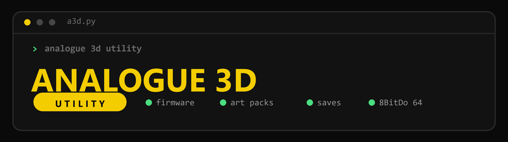

<p align="center">
  
</p>

<p align="center">
  
  
  
</p>

# Analogue 3D Utility

A clean, dark, **terminal-native** companion for the **Analogue 3D** and its
**8BitDo 64** controller. One arrow-key menu handles console firmware, cartridge
art packs, save backups, and flashing the controller — no GUI, no vendor
software, no driver swaps.

> ### One line to run it
> **If you have Python, just run it** — the launcher installs anything it needs,
> auto-detects your SD card, and drops you into the menu:
> ```bash
> python a3d.py
> ```

---

## Features

Navigate with the **arrow keys** (falls back to a numbered menu in plain
terminals).

- **Auto — do everything** — one choice backs up the card, updates console
  firmware, installs the art pack, and (if it's plugged in) updates the
  8BitDo 64 controller.
- **Console firmware** — grabs the latest Analogue 3D firmware from `analogue.co`
  and copies it to the SD card, cleaning up old `a3d_os_*.bin` files.
- **Cartridge art packs** — install a community art pack (RetroGameCorps), a
  custom URL, or a `labels.db` you assembled yourself (e.g. via a3d-tools.online).
- **Backup & restore** — zips up your `Library` and `Settings` folders, restores
  them on demand, and cleans out old backups.
- **Controller-pak saves** — back up and restore your N64 save data
  (`controller_pak.img`) per game.
- **8BitDo 64 controller flashing** — updates the Analogue 3D's controller over
  USB‑C **without** 8BitDo's Ultimate Software, a browser, or any driver swap.
  Pick a specific firmware version (including official downgrades).
- **Advanced** — set one cartridge's art by ID/ROM, and clean old backups.

---

## Quick start

```bash
# 1. Get the code
git clone https://github.com/auntiepickle/Analogue3DUtility.git
cd Analogue3DUtility

# 2. Run it (it installs its own dependencies the first time)
python a3d.py
```

Then pick what you want from the menu. That's it.

On first launch the script checks for the packages it needs and offers to
`pip install` them for you, so you don't have to install anything by hand. If you'd
rather install them yourself up front, run `pip install -r requirements.txt`.

### Requirements

- Python 3.7+
- The packages in [`requirements.txt`](requirements.txt):
  - **Core:** `requests`, `beautifulsoup4`, `psutil`
  - **Nicer UI:** `rich`, `questionary` (arrow-key menu; without them you get a
    plain numbered menu)
  - **Feature extras:** `hidapi` (8BitDo 64 controller), `pillow` (custom cart art)
- The launcher offers to install all of these for you on first run; missing
  optional packages just disable their feature, they don't block the tool.

---

## Updating the Analogue 3D (SD card)

Pop the console's SD card into your computer and run the tool. The menu covers
firmware, art packs, backups, and restores. The tool auto-detects the card by its
contents (an `a3d_os_*.bin` file, `Library`/`Settings` folders, or an
**ANALOGUE 3D** volume label) and pre-selects it, so you usually just confirm.
After a firmware update, eject the card, put it back in the console, and follow
Analogue's on-screen update prompt.

---

## Cartridge art packs

Pick **Install cartridge art pack** and choose where the pack comes from:
the RetroGameCorps community pack (downloaded), a custom URL, or a local
`labels.db` file you assembled yourself. The pack is copied to
`Library/N64/Images/labels.db` on the card.

To replace a *single* cart's art, use **Advanced → Set one cartridge's art** and
identify the cart by its ROM (the tool computes the ID) or its 8‑character ID.
The image is resized to 74×86 and written into `labels.db`. Requires `pillow`.

## Controller-pak saves

**Back up / restore game saves** lists every game on the card that has save data
and lets you back it up (copied locally) or restore a previous backup. Useful
before experimenting or to move saves between cards.

## Updating the 8BitDo 64 controller

1. Connect the controller to your computer with a USB‑C **data** cable.
2. Power it on.
3. Run the tool and choose **Flash 8BitDo 64 controller**.
4. Pick a firmware version (the latest is preselected) and confirm.

The tool talks the controller's own HID flashing protocol directly — the same one
8BitDo's web updater uses — so there's nothing extra to install. It downloads the
official firmware straight from 8BitDo, writes it in CRC‑checked blocks, and then
reboots the controller and re-reads the version to confirm success.

**Downgrades are supported.** 8BitDo's own updater lets you choose older official
releases, and so does this tool — handy if a new release misbehaves. Downgrades
are flagged with a warning since they're less common than updates.

### Supported firmware

This tool is verified against firmware **up to v2.04**. When 8BitDo publishes
something newer, the tool will still list it but tag it **`untested`** and warn
before flashing it. The maintainer bumps the tested ceiling
(`MAX_TESTED_VERSION` in `controller.py`) as each new release is
validated on real hardware.

---

## Roadmap / ideas

- **Per-game display & hardware presets** — the Analogue 3D supports per-cart
  settings (CRT/scanline modes, overclock, region override, etc.). Rather than
  expose every knob (which is what makes other tools feel overwhelming), the plan
  is to let you apply curated **presets pulled from a community source**, so you
  get good results without hand-tuning jargon. Not built yet.

---

## ⚠️ Disclaimer — use at your own risk

This is an unofficial, community-built tool. It is **not affiliated with,
endorsed by, or supported by Analogue, Inc. or 8BitDo** in any way. All firmware
is downloaded from those vendors' own servers; this tool just automates fetching
and flashing it.

Flashing firmware to any device carries inherent risk. While the controller
updater is designed to be safe and recoverable (it writes only the application
region, verifies each block, and leaves the bootloader intact so a failed flash
can be retried), **no guarantee of any kind is made.**

**THE SOFTWARE IS PROVIDED "AS IS", WITHOUT WARRANTY OF ANY KIND, EXPRESS OR
IMPLIED.** By using this tool you accept full responsibility for any outcome,
including but not limited to data loss or a bricked/damaged device. The authors
and contributors are **not liable** for any damage. If you are unsure, use the
official Analogue and 8BitDo tools instead.

Do not unplug the controller or remove the SD card while a write is in progress.
