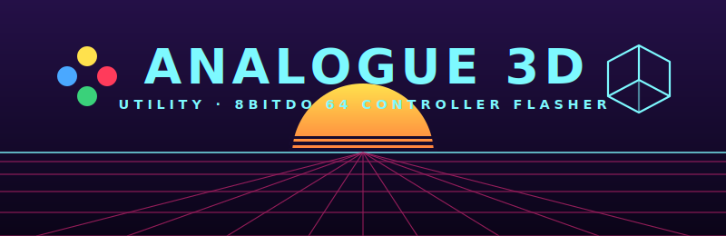

<p align="center">
  
</p>

# Analogue 3D Utility

A no-nonsense, cross-platform Python tool for keeping your **Analogue 3D** (and its
**8BitDo 64** controller) up to date — firmware, cartridge labels, backups, and
controller flashing — all from one terminal menu.

Think of it as the spiritual successor to PocketSync, but for the Analogue 3D
(until someone makes a proper GUI).

> ### Usage in one line
> **If you have Python, just run it** — the script installs anything it needs and
> drops you into a menu:
> ```bash
> python a3d.py
> ```
> It auto-detects your Analogue 3D SD card and walks you through the rest.

---

## Features

- **Console firmware** — always grabs the latest Analogue 3D firmware from
  `analogue.co` and copies it to your SD card, cleaning up old `a3d_os_*.bin` files.
- **Cartridge labels** — installs/updates the community label database so your
  carts show their box art.
- **Backup & restore** — zips up your `Library` and `Settings` folders, restores
  them on demand, and cleans out old backups.
- **8BitDo 64 controller flashing** — updates the Analogue 3D's controller over
  USB‑C **without** 8BitDo's Ultimate Software, a browser, or any driver swap.
  Supports picking a specific firmware version (including official downgrades).

---

## Quick start

```bash
# 1. Get the code
git clone https://github.com/auntiepickle/Analogue3DUtility.git
cd Analogue3DUtility

# 2. Run it (it installs its own dependencies the first time)
python a3d.py
```

Then pick what you want from the menu. That's it.

On first launch the script checks for the packages it needs and offers to
`pip install` them for you, so you don't have to install anything by hand. If you'd
rather install them yourself up front, run `pip install -r requirements.txt`.

### Requirements

- Python 3.7+
- The packages in [`requirements.txt`](requirements.txt): `requests`,
  `beautifulsoup4`, `psutil`, and `hidapi`.
- `hidapi` is only needed for the controller updater (option 7); everything else
  works without it.

---

## Updating the Analogue 3D (SD card)

Pop the console's SD card into your computer and run the tool. Options 1–5 cover
firmware, labels, backups, and restores. The tool auto-detects removable drives
and will auto-pick a card labelled **ANALOGUE 3D** when it finds one. After a
firmware update, eject the card, put it back in the console, and follow Analogue's
on-screen update prompt.

---

## Updating the 8BitDo 64 controller (option 7)

1. Connect the controller to your computer with a USB‑C **data** cable.
2. Power it on.
3. Run the tool and choose **option 7**.
4. Pick a firmware version (press Enter for the latest) and confirm.

The tool talks the controller's own HID flashing protocol directly — the same one
8BitDo's web updater uses — so there's nothing extra to install. It downloads the
official firmware straight from 8BitDo, writes it in CRC‑checked blocks, and then
reboots the controller and re-reads the version to confirm success.

**Downgrades are supported.** 8BitDo's own updater lets you choose older official
releases, and so does this tool — handy if a new release misbehaves. Downgrades
are flagged with a warning since they're less common than updates.

### Supported firmware

This tool is verified against firmware **up to v2.04**. When 8BitDo publishes
something newer, the tool will still list it but tag it **`untested`** and warn
before flashing it. The maintainer bumps the tested ceiling
(`MAX_TESTED_VERSION` in `controller.py`) as each new release is
validated on real hardware.

---

## ⚠️ Disclaimer — use at your own risk

This is an unofficial, community-built tool. It is **not affiliated with,
endorsed by, or supported by Analogue, Inc. or 8BitDo** in any way. All firmware
is downloaded from those vendors' own servers; this tool just automates fetching
and flashing it.

Flashing firmware to any device carries inherent risk. While the controller
updater is designed to be safe and recoverable (it writes only the application
region, verifies each block, and leaves the bootloader intact so a failed flash
can be retried), **no guarantee of any kind is made.**

**THE SOFTWARE IS PROVIDED "AS IS", WITHOUT WARRANTY OF ANY KIND, EXPRESS OR
IMPLIED.** By using this tool you accept full responsibility for any outcome,
including but not limited to data loss or a bricked/damaged device. The authors
and contributors are **not liable** for any damage. If you are unsure, use the
official Analogue and 8BitDo tools instead.

Do not unplug the controller or remove the SD card while a write is in progress.
